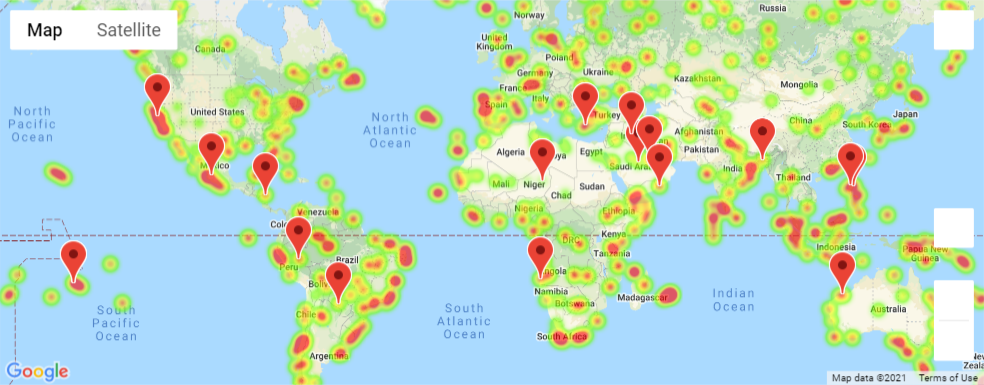

# Weather and Vacation Analysis

I created a Python script to visualize the weather for over 500 cities around the world.

# Observations for WeatherPy

1. Highest temperatures are found at or near 0 latitude. As latitude increases or ddecreases, temperatures drop dramatically.

2. Latitude appears to have no influence on Cloudiness or Wind Speed.

3. Humidity percentages decrease sharply as you near each pole, with the highest humidity readings clustered in the -20 to +20 latitude range.

# VacationPy

Below is a heatmap of the cities fitting my ideal weather criteria.

